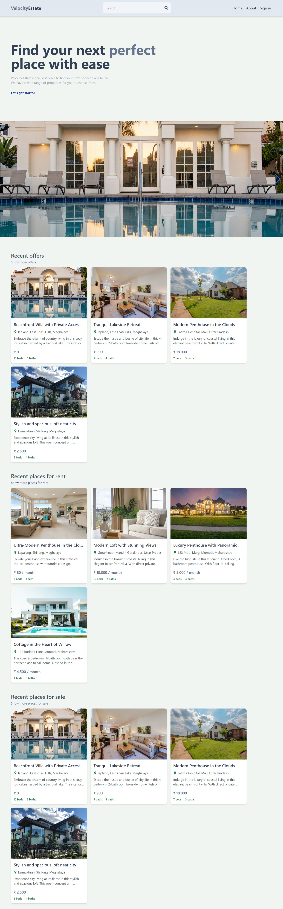

# Velocity Real Estate

The live link can be found <a href="https://velocity-estate.onrender.com/" target="_blank" rel="noopener">here</a>.

# Briefing

**Velocity-Estate** is a modern real estate web application built with the MERN (MongoDB, Express.js, React, Node.js) stack. It provides a platform for users to search, list, and explore various properties, whether for sale or rent. The application offers a user-friendly interface, advanced search options, and a seamless user experience. The objective of this project is to connect home buyers to sellers and tenants to renters directly to facilitate services including home trading and residential leasing without the intervention of local real estate agency as mostly they add no value to the transactions but substantially cost for both parties.

### User Roles

Home Buyer / Tenant

- Allow the visitor to be able to search for a property according to its type(rent or sale), offer, parking, furnished and price.
- Allow user to filter properties according to its prices.
- Allow visitors the option to contact landlord directly from the site.
- Allow the visitor to be able to create an account and manage their own content in the site.
- Click on a property to read the full information about that property.

Home Seller / Renter

- Able to **add a new property easily** for rent/sale.
- Able to **see all existing properties** in a simple and easy manner.
- Able to **manage the existing properties such as edit price or delete** easily.

# Features

- **Property Listings**: View a wide range of property listings with detailed information, including descriptions, prices, addresses, and more.

- **Advanced Search**: Customize your property search by type (rent/sale), amenities, sorting options, and more.

- **User Profiles**: Registered users can create and manage their profiles with profile pictures and listings also.

- **Authentication**: Secure user registration and login functionality with Google OAuth.

# Technologies Used

- [ReactJs](https://reactjs.org/)
- [Redux](https://redux.js.org/)
- [ExpressJS](https://expressjs.com/)
- [NodeJs](https://nodejs.org/en/learn/getting-started/introduction-to-nodejs)
- [MongoDB](https://www.mongodb.com/docs/)
- [Tailwind CSS](https://tailwindcss.com/)
- [Firebase](https://firebase.google.com/)
- [GitHub](http://github.com)

# Author

Made with ❤️ by <b>Samarth Verma</b>  Get in touch!

[LINKEDIN](https://www.linkedin.com/in/samarth2804/)

# Screenshot

